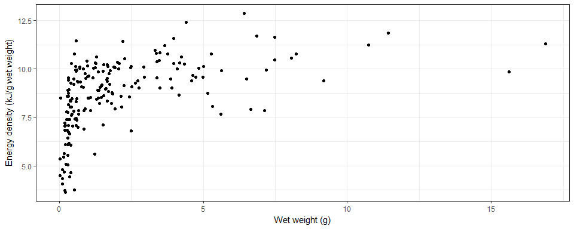
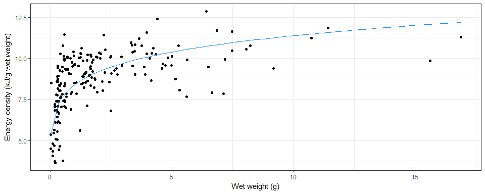
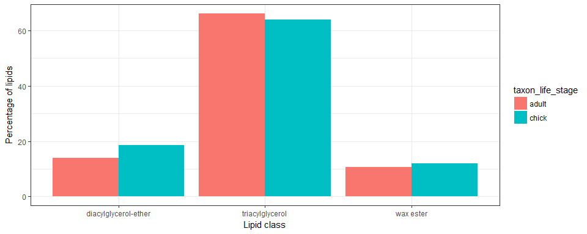

<!-- README.md is generated from README.Rmd. Please edit that file -->
sohungry
========

[](https://travis-ci.org/SCAR/sohungry) [](https://ci.appveyor.com/project/SCAR/sohungry)
[](http://www.repostatus.org/#active)
[](http://cran.r-project.org/web/packages/sohungry)


Overview
--------

This R package provides access to the SCAR Southern Ocean Diet and Energetics Database, and some tools for working with these data. For more information about the database see <http://data.aad.gov.au/trophic/>.

### Installing

``` r
install.packages("devtools")
library(devtools)
install_github("SCAR/sohungry")
```

Usage
-----

Basic usage: load the desired dataset using `so_isotopes()`, `so_energetics()`, `so_lipids()`, `so_dna_diet()`, or `so_diet()`.

Examples
--------

``` r
library(sohungry)
library(dplyr)
library(tidyr)
library(ggplot2)
```

### Isotopes

Load the stable isotope data:

``` r
xi <- so_isotopes(format="mv")
```

Filter to taxon of interest, selecting d13C and d15N records:

``` r
xi %>% dplyr::filter(taxon_name=="Electrona carlsbergi" & measurement_name %in% c("delta_13C", "delta_15N"))
#> # A tibble: 4 x 50
#>   record_id source_id original_record_id location   west  east south north
#>       <int>     <int> <chr>              <chr>     <dbl> <dbl> <dbl> <dbl>
#> 1      1663         8 Raymond et al. RE~ Kerguele~  71.2  72.2 -49.3 -49.1
#> 2      1663         8 Raymond et al. RE~ Kerguele~  71.2  72.2 -49.3 -49.1
#> 3       483        12 Raymond et al. RE~ East of ~  70.3  70.3 -49.4 -49.4
#> 4       483        12 Raymond et al. RE~ East of ~  70.3  70.3 -49.4 -49.4
#> # ... with 42 more variables: observation_date_start <dttm>,
#> #   observation_date_end <dttm>, altitude_min <chr>, altitude_max <chr>,
#> #   depth_min <int>, depth_max <int>, taxon_name <chr>,
#> #   taxon_name_original <chr>, taxon_aphia_id <int>,
#> #   taxon_worms_rank <chr>, taxon_worms_kingdom <chr>,
#> #   taxon_worms_phylum <chr>, taxon_worms_class <chr>,
#> #   taxon_worms_order <chr>, taxon_worms_family <chr>,
#> #   taxon_worms_genus <chr>, taxon_group_soki <chr>,
#> #   taxon_breeding_stage <chr>, taxon_life_stage <chr>, taxon_sex <chr>,
#> #   taxon_sample_count <int>, taxon_sample_id <int>,
#> #   isotopes_pretreatment <chr>, isotopes_are_adjusted <chr>,
#> #   isotopes_adjustment_notes <chr>, isotopes_carbonates_treatment <chr>,
#> #   isotopes_lipids_treatment <chr>, isotopes_body_part_used <chr>,
#> #   measurement_name <chr>, measurement_min_value <chr>,
#> #   measurement_max_value <chr>, measurement_mean_value <dbl>,
#> #   measurement_variability_value <dbl>,
#> #   measurement_variability_type <chr>, measurement_units <chr>,
#> #   measurement_method <chr>, is_secondary_data <chr>, quality_flag <chr>,
#> #   notes <chr>, last_modified <dttm>, source_details <chr>,
#> #   source_doi <chr>
```

### Diet

Load the diet data (stomach content analyses and similar):

``` r
x <- so_diet()
```

A summary of what *Electrona carlsbergi* eats:

``` r
x %>% filter_by_predator_name("Electrona carlsbergi") %>% diet_summary(summary_type="prey")
#> # A tibble: 12 x 7
#>    prey            fraction_diet_by_~ N_fraction_diet_by~ fraction_occurr~
#>    <chr>                        <dbl>               <int>            <dbl>
#>  1 <i>Euphausia s~           NaN                        0          0.0190 
#>  2 Chaetognatha (~             0.0970                   1        NaN      
#>  3 Copepoda (cope~           NaN                        0          0.0483 
#>  4 Crustacea (cru~             0.110                    1          0.411  
#>  5 Euphausiids (o~             0.322                    1          0.0977 
#>  6 Fish                        0.123                    1        NaN      
#>  7 Heterorhabdidae           NaN                        0          0.00630
#>  8 Hyperiidea (hy~             0.410                    1          0.204  
#>  9 Malacostraca (~             0.0135                   1          0.200  
#> 10 Maxillopoda (c~             0.0420                   1          0.104  
#> 11 Salps                     NaN                        0          0.202  
#> 12 Uncategorized ~             0.384                    1          0.411  
#> # ... with 3 more variables: N_fraction_occurrence <int>,
#> #   fraction_diet_by_prey_items <dbl>, N_fraction_diet_by_prey_items <int>
```

And what eats *Electrona carlsbergi*:

``` r
x %>% filter_by_prey_name("Electrona carlsbergi") %>% diet_summary(summary_type="predators")
#> # A tibble: 14 x 7
#>    predator          fraction_diet_by_~ N_fraction_diet_~ fraction_occurr~
#>    <chr>                          <dbl>             <int>            <dbl>
#>  1 <i>Aptenodytes p~            0.0750                  1          0.236  
#>  2 <i>Arctocephalus~            0.00331                 1          0.0503 
#>  3 <i>Champsocephal~          NaN                       0          0.00213
#>  4 <i>Dissostichus<~          NaN                       0          0.00710
#>  5 <i>Eudyptes chry~          NaN                       0          0.0540 
#>  6 <i>Eudyptes chry~          NaN                       0          0.0630 
#>  7 <i>Eudyptes schl~            0.0964                  1          0.204  
#>  8 <i>Mirounga leon~          NaN                       0          0.0920 
#>  9 <i>Pygoscelis pa~            0.275                   1          0.184  
#> 10 Diomedeidae (alb~            0                       1          0.0318 
#> 11 Onychoteuthidae ~            0.0660                  1          0.153  
#> 12 Otariidae (eared~          NaN                       0          0.0420 
#> 13 Phalacrocoracida~          NaN                       0          0.00900
#> 14 Procellariidae (~            0.0126                  1          0.0824 
#> # ... with 3 more variables: N_fraction_occurrence <int>,
#> #   fraction_diet_by_prey_items <dbl>, N_fraction_diet_by_prey_items <int>
```

### Energetics

``` r
xe <- so_energetics()
```

Select all single-individual records of *Electrona antarctica*:

``` r
edx <- xe %>% filter(taxon_sample_count==1 & taxon_name=="Electrona antarctica")

## discard the dry-weight energy density values
edx <- edx %>% filter(measurement_units!="kJ/gDW")

## some data manipulation
edx <- edx %>%
  ## remove the spaces from the measurement names, for convenience
  mutate(measurement_name=gsub("[[:space:]]+", "_", measurement_name)) %>%
  ## convert to wide format
  dplyr::select(source_id, taxon_sample_id, measurement_name, measurement_mean_value) %>%
  tidyr::spread(measurement_name, measurement_mean_value)

## what does this look like?
edx
#> # A tibble: 197 x 8
#>    source_id taxon_sample_id dry_weight energy_content standard_length
#>        <int>           <int>      <dbl>          <dbl>           <dbl>
#>  1        64              37    1.20              8.64            70.0
#>  2        64              38    0.00670           5.34            15.0
#>  3        64              39    0.00675           4.51            16.0
#>  4        64              40    0.600             6.79            58.0
#>  5        64              41    0.307             7.84            47.0
#>  6        64              42    0.498             8.35            56.0
#>  7        64              43    1.52              8.73            77.0
#>  8        64              44    2.87              9.38            90.0
#>  9        64              47    0.0890            3.76            37.0
#> 10        64              48    0.396             7.12            53.0
#> # ... with 187 more rows, and 3 more variables: total_length <dbl>,
#> #   water_content <dbl>, wet_weight <dbl>
```

Plot the wet weight against wet-weight energy density:

``` r
p <- ggplot(edx, aes(wet_weight, energy_content))+geom_point()+theme_bw()+
  labs(x="Wet weight (g)", y="Energy density (kJ/g wet weight)")
plot(p)
```



Fit an allometric equation:

``` r
fit <- lm(log(energy_content)~log(wet_weight), data=edx)
px <- tibble(wet_weight=seq(from=min(edx$wet_weight), to=max(edx$wet_weight), length.out=51))
px$energy_content <- exp(predict(fit, newdata=px))
p+geom_path(data=px, colour="dodgerblue")
```



### Lipids and fatty acids

``` r
xl <- so_lipids()
```

Select lipid-class data from Connan et al. (2007), and plot similar to Figure 2 from that paper:

``` r
xl <- xl %>% dplyr::filter(source_id==126 & measurement_class=="lipid class") %>%
  mutate(measurement_name=sub(" content", "", measurement_name)) ## tidy the names a little

ggplot(xl,
  aes(measurement_name, measurement_mean_value, fill=taxon_life_stage, group=taxon_life_stage))+
  geom_col(position="dodge")+theme_bw()+
  labs(x="Lipid class", y="Percentage of lipids")
```


